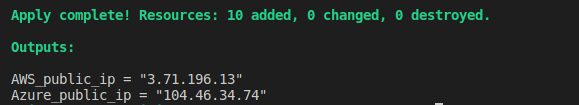

### Created terraform modules for deploy Grafana on AWS and Azure clouds 

1. Were Created two terraform modules for provisioning one AWS and one Azure instance.
2. Variables were used when creating modules.
3. Was provisioned one SSH public key for created instances.
4. Firewalls were configured for VM access from the Internet.
5. VM public IP addresses were added to the output values.
6. Was installed Grafana on servers.
7. Was changed Grafana port on 80.

[AWS_public_ip = "3.71.196.13"](3.71.196.13)
[Azure_public_ip = "104.46.34.74"](104.46.34.74)

